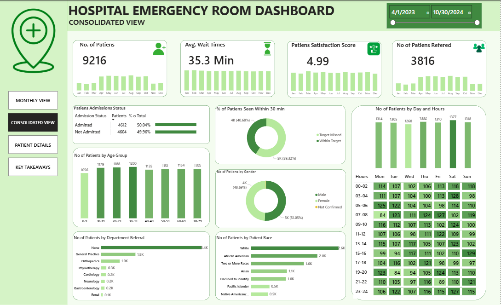
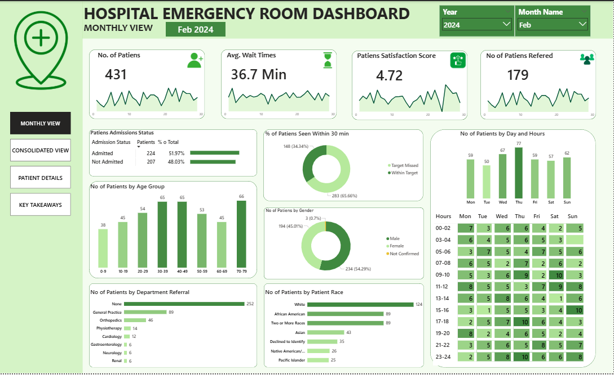
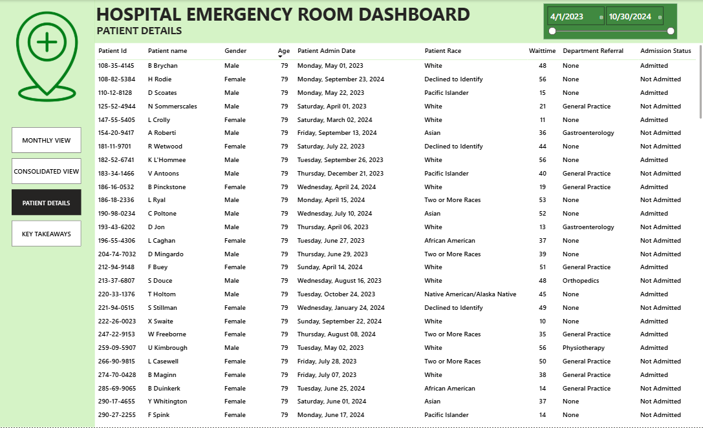
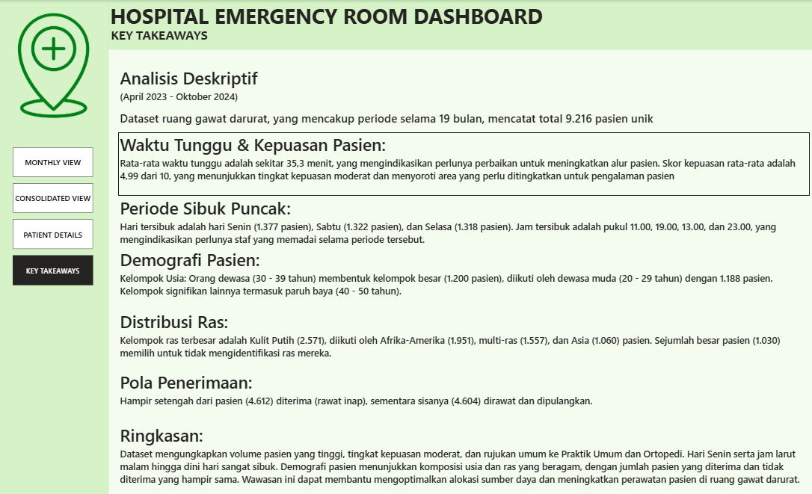

# 🏥 Hospital Emergency Room (ER) Analysis — Power BI Dashboard

> An interactive **Power BI** dashboard analyzing ~9,200 emergency-room visits to monitor ER
> performance: patient volume, wait times, satisfaction, admissions, department referrals,
> patient demographics, and temporal (day/hour/month) patterns.



---

## 📊 Overview

This project turns an Emergency Room patient dataset into a decision-ready Power BI report.
It helps hospital staff and analysts answer questions such as:

- How busy is the ER, and **when** are the peak hours / days?
- What is the **average wait time**, and what share of patients are seen within 30 minutes?
- How **satisfied** are patients, and how does that relate to wait time?
- What is the **admission rate** and which **departments** receive the most referrals?
- What do our **patient demographics** (age, gender, race) look like?

The report is organized into **4 pages**:

| # | Page | Purpose |
|---|------|---------|
| 1 | **Monthly View** | Drill into a single year + month |
| 2 | **Consolidated View** | Full-period KPIs and trends |
| 3 | **Patient Details** | Granular per-patient records |
| 4 | **Key Takeaways** | Summary of the main insights |

---

## 🔑 Key Metrics (full period — Apr 2023 → Oct 2024)

All figures below are computed from the source data (`Hospital ER_Data.csv`, 9,216 visits):

| Metric | Value |
|--------|-------|
| Total ER visits | **9,216** (2023: 4,338 · 2024: 4,878) |
| Avg. wait time | **35.3 minutes** (range 10–60) |
| Avg. patient satisfaction | **4.99 / 10** (recorded for 2,517 patients) |
| Admissions | **4,612 admitted** vs **4,604 not admitted** (~50/50) |
| Referred to a department | **3,816** of 9,216 patients |
| Gender split | **4,705 male** · **4,487 female** · 24 not confirmed |
| Patient age range | **1 – 79** years |

**Top referral departments:** General Practice (1,840) · Orthopedics (995) · Physiotherapy (276) ·
Cardiology (248) · Neurology (193) · Gastroenterology (178) · Renal (86).

---

## 🗂️ Data Source & Schema

Source file: `Hospital ER_Data.csv` — **9,216 rows × 12 columns** (the raw CSV is **not** included
in this repository; only the finished `.pbix` report is).

| Column | Description |
|--------|-------------|
| `Patient Id` | Unique patient identifier |
| `Patient Admission Date` | Date & time of the ER visit (Apr 2023 – Oct 2024) |
| `Patient First Inital` | Patient's first initial |
| `Patient Last Name` | Patient's last name |
| `Patient Gender` | `M` / `F` / `NC` (not confirmed) |
| `Patient Age` | Age in years (1–79) |
| `Patient Race` | Race / ethnicity category |
| `Department Referral` | Department referred to (`None`, General Practice, Orthopedics, …) |
| `Patient Admission Flag` | Whether the patient was admitted (`TRUE` / `FALSE`) |
| `Patient Satisfaction Score` | Satisfaction on a 0–10 scale (blank if not provided) |
| `Patient Waittime` | Wait time in minutes |
| `Patients CM` | Care-management flag |

---

## 📈 Dashboard Pages

### 1. Monthly View


Filter the whole report to a specific **year and month** with the slicers at the top. The page
shows headline KPI cards (patients, average wait time, satisfaction, referrals) each with a trend
sparkline, followed by breakdowns: admission status, age group, department referral, race, the
**share of patients seen within 30 minutes** (donut), gender (donut), and a **day-of-week × hour**
patient-volume matrix.

### 2. Consolidated View


The full-period overview (Apr 2023 – Oct 2024). The same headline KPIs aggregated across all
months, monthly trend bars for each KPI, the % of patients seen within 30 minutes, the day × hour
volume matrix, and demographic / department breakdowns for the entire dataset.

### 3. Patient Details


A granular, row-level table of individual patient records. Exposes patient-level attributes — ID,
demographics, department referral, admission status, satisfaction and wait time — so users can look
up and explore specific visits in detail.

### 4. Key Takeaways


A conclusions page that summarizes the main findings of the analysis: wait time & patient
satisfaction, peak and low-load periods, patient demographics, key distribution ratios, and an
overall summary.

---

## 🛠️ Tools & Techniques

- **Power BI Desktop** — report build, data model, and visual design
- **DAX** measures for KPIs, averages, ratios and time-based aggregations
- A date/calendar approach to power the monthly vs. consolidated views
- KPI cards, donut/bar/line charts, a day × hour matrix, and drill-down slicers

---

## ▶️ How to Open

1. Download `Hospital_ER_analysis.pbix` from this folder.
2. Open it in **[Power BI Desktop](https://powerbi.microsoft.com/desktop/)** (free).
3. Use the left-hand navigation pane to switch between *Monthly View*, *Consolidated View*,
   *Patient Details*, and *Key Takeaways*.

---

## 📁 Files in this folder

```
Hospital/
├── Hospital_ER_analysis.pbix     # Power BI report (open in Power BI Desktop)
├── README.md                     # this file
└── screenshots/
    ├── 01-monthly-view.png
    ├── 02-consolidated-view.png
    ├── 03-patient-details.png
    └── 04-key-takeaways.png
```

---

## 📌 Notes

- The raw dataset (`Hospital ER_Data.csv`) is **not** included here; all figures above are computed
  from it and match the values displayed in the dashboard.
- Patient names/IDs in the source are sample / anonymized data.
- `.pbix` is a binary format, so GitHub cannot show line-by-line diffs — download the file to view
  and interact with the report.
