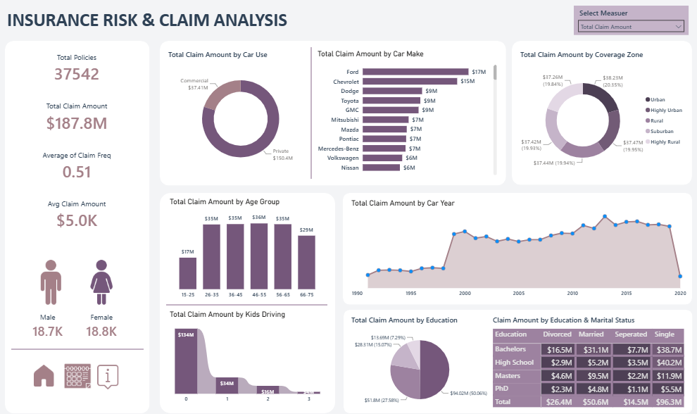

# 🚗 Dashboard Insurance Risk and Claim Analysis

## 📌 Ringkasan
Repositori ini berisi dasbor analitik interaktif yang dirancang untuk memantau dan mengevaluasi risiko asuransi dan pola klaim. Dasbor ini memberikan wawasan komprehensif mengenai demografi pemegang polis, spesifikasi kendaraan, dan zona pertanggungan untuk membantu mengidentifikasi faktor utama dari jumlah dan frekuensi klaim.

Antarmuka (UI) dasbor ini sengaja dirancang menggunakan tema **Monochromatic Muted Purple/Mauve**, beralih dari warna neon yang mencolok untuk memberikan pengalaman analitik yang modern, profesional, dan lebih nyaman di mata.

## 📊 Metrik Utama & KPI
- **Total Polis:** 37.542
- **Total Jumlah Klaim:** $187,8 Juta
- **Rata-rata Frekuensi Klaim:** 0,51
- **Rata-rata Jumlah Klaim:** $5,0 Ribu
- **Distribusi Demografi:** Distribusi seimbang antara pemegang polis Pria (18.7K) dan Wanita (18.8K).

## 🔍 Visualisasi & Wawasan Utama
- **Penggunaan & Merek Kendaraan:** Rincian jumlah klaim yang membandingkan penggunaan Pribadi vs. Komersial, serta menyoroti produsen mobil teratas (Ford, Chevrolet) berdasarkan volume klaim.
- **Risiko Zona Pertanggungan:** Distribusi dampak finansial di wilayah Perkotaan (*Urban*), Pedesaan (*Rural*), dan Pinggiran Kota (*Suburban*).
- **Faktor Risiko Demografi:** Analisis jumlah klaim yang disegmentasi berdasarkan **Kelompok Usia** (diimplementasikan menggunakan pengelompokan DAX kustom), **Tingkat Pendidikan**, dan **Status Pernikahan**.
- **Tren Historis:** Analisis deret waktu (*time-series*) dari jumlah klaim berdasarkan **Tahun Kendaraan** (1990-2020).
- **Dampak Keluarga:** Evaluasi korelasi antara jumlah anak yang mengemudi dan total jumlah klaim.

## 🛠️ Alat & Teknologi
- **Alat BI:** Power BI *(Ubah jika Anda menggunakan Tableau/Looker)*
- **Pemrosesan Data:** Pemodelan Data, DAX (*Data Analysis Expressions*) untuk kolom dan *measure* kustom.
- **Desain & UI/UX:** Palet *Monochromatic Muted Mauve* kustom yang disesuaikan untuk presentasi data profesional dan mengurangi kelelahan visual.

## 🚀 Cara Menggunakan
1. Unduh file `.pbix` dari repositori ini.
2. Buka menggunakan **Power BI Desktop**.
3. Gunakan panel filter/slicer di kanan atas untuk memfilter data berdasarkan metrik tertentu (misalnya, Total Jumlah Klaim).

---

## 🎓 Referensi

Dashboard ini dibuat sebagai proyek pembelajaran dengan mengikuti tutorial:

🎬 **[Build an Advanced Power BI Dashboard | End-to-End Project Tutorial (2026) #powerbi #python](https://youtu.be/vFq29iEtLBQ?si=u36D0uF3WqJWlWT3)**

Terima kasih kepada pembuat tutorial atas panduan yang sangat membantu dalam membangun dashboard ini.

---
## 👨‍💻 Penulis

