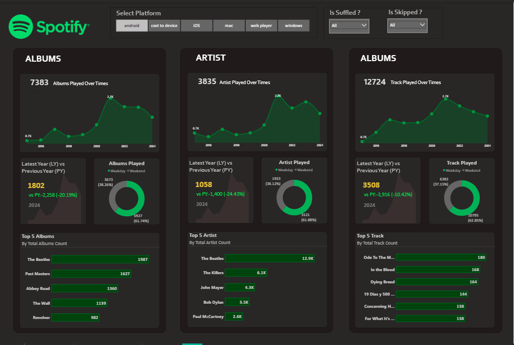
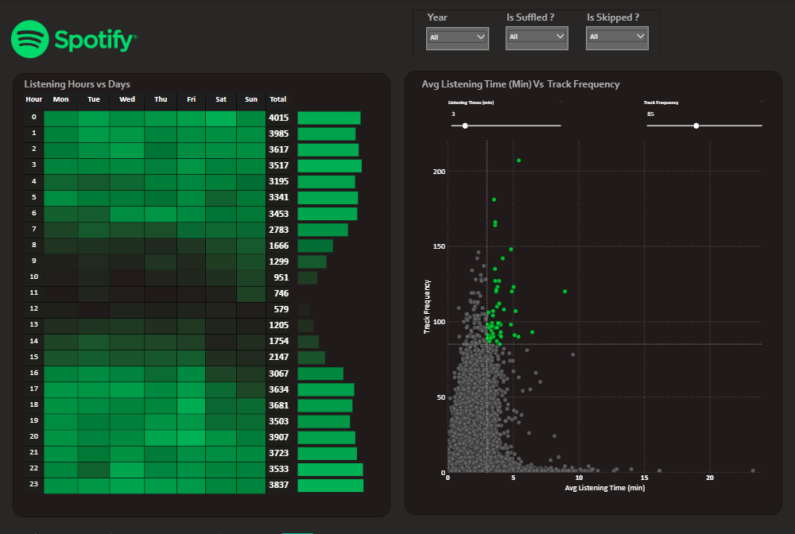
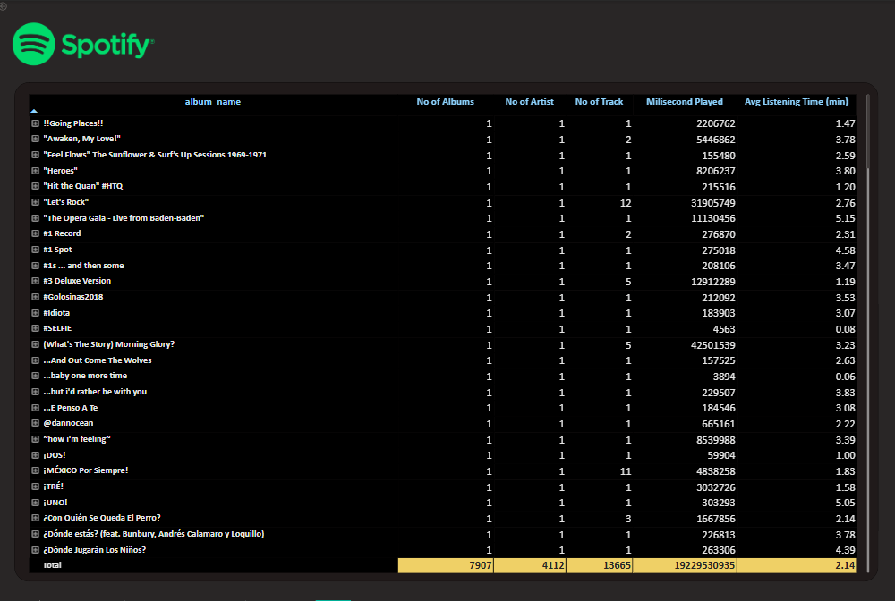

<div align="center">


# 🎧 Spotify Analysis — Power BI Dashboard

**Dashboard analisis riwayat streaming Spotify yang interaktif** untuk mengungkap pola listening, tren album/artist/track, dan kebiasaan mendengarkan musik dari tahun ke tahun.

[](https://powerbi.microsoft.com/)
[]()
[]()
[]()

</div>

---

## 📖 Tentang Proyek

Proyek ini adalah dashboard **Power BI** yang menganalisis data **riwayat streaming Spotify pribadi** mencakup periode **2013–2024**. Dashboard dirancang untuk mengubah ribuan baris data listening mentah menjadi insight yang mudah dipahami — mulai dari album/artist/track paling sering diputar, pola mendengarkan berdasarkan hari (weekday vs weekend) dan jam (heat map), hingga analisis Year-over-Year (YoY).

Dashboard dibangun mengikuti alur kerja analisis data end-to-end, mulai dari *requirement gathering*, *data cleaning*, *data modeling*, perhitungan **DAX**, hingga pengembangan visual dan *insights generation*.

> 🎓 **Catatan:** Dashboard ini dibuat sebagai proyek pembelajaran mengikuti tutorial referensi yang tercantum di section [Referensi](#-referensi).

---

## 🎯 Tujuan / Business Requirement

Dalam era musik digital, memahami pola listening sangat penting, baik bagi pengguna maupun platform streaming. Dashboard ini menjawab kebutuhan analisis berikut untuk masing-masing kategori **Albums**, **Artists**, dan **Tracks**:

- 🎵 **Total diputar dari waktu ke waktu** — tren bulanan & tahunan.
- 📅 **Jumlah unik per tahun** — kebiasaan listening tahunan (cari nilai **Min & Max**).
- 💥 **Weekday vs Weekend** — pola mendengarkan di hari kerja vs akhir pekan.
- 🏆 **Top 5** — album/artist/track paling sering diputar berdasarkan frekuensi.
- 📊 **Latest Year (LY) vs Previous Year (PY)** — perbandingan tren & **YoY Growth Analysis**.

Selain itu, terdapat analisis khusus **Listening Patterns** dan **Details Grid** interaktif.

---

## 📊 Halaman Dashboard



Dashboard terdiri dari beberapa halaman analisis:

| Halaman | Visualisasi & Fitur |
|---|---|
| 🎵 **Albums** | Total album over time, album per tahun (min/max), weekday vs weekend, Top 5 Albums, LY vs PY + YoY |
| 🎤 **Artists** | Total artist over time, artist per tahun (min/max), weekday vs weekend, Top 5 Artists, LY vs PY + YoY |
| 🎶 **Tracks** | Total track over time, track per tahun (min/max), weekday vs weekend, Top 5 Tracks, LY vs PY + YoY |
| 🕒 **Listening Patterns** | **Heat Map** jam vs hari (jam listening puncak) + **Scatter Plot Quadrant** (Average Listening Time vs Track Frequency) |
| 📋 **Details Grid** | Grid interaktif dengan **Drill Through** (export ke CSV), **Drill Down / Drill Up**, dan navigasi hierarki |

### Analisis Scatter Quadrant (Listening Patterns)



Mengategorikan track ke dalam 4 kuadran:
- 🎯 **High Frequency & High Listening Time** → Track paling engaging
- 💎 **Low Frequency & High Listening Time** → Track niche tapi berdampak
- ⚡ **High Frequency & Low Listening Time** → Track pendek yang sering diputar
- 📉 **Low Frequency & Low Listening Time** → Track kurang populer


### Details



---

## 🔍 Insight Utama (berdasarkan dataset)

> ⚠️ Angka di bawah adalah ringkasan dari dataset riwayat streaming yang mendasari dashboard.

- 🔢 **Total data streaming dianalisis:** ± **149.860 baris** (periode 2013–2024)
- 📈 **Tahun puncak aktivitas:** **2017** (± 26.320 play)
- 🏆 **Top 5 Artist:**
  1. **The Beatles** (13.621)
  2. The Killers (6.878)
  3. John Mayer (4.855)
  4. Bob Dylan (3.814)
  5. Paul McCartney (2.697)
- 💿 **Top 5 Album:**
  1. **The Beatles** (2.063)
  2. Past Masters (1.672)
  3. Abbey Road (1.429)
  4. The Wall (1.241)
  5. Revolver (1.038)
- 📱 **Platform dominan:** **Android** (± 139.821 play), disusul cast to device, iOS, Windows, dan Mac.

---

## 📁 Dataset

**Sumber data:** Riwayat streaming Spotify pribadi (*Spotify streaming history export*), berisi ± **149.860 baris** dengan periode 2013–2024.

### Data Dictionary (11 Kolom)

| Kolom | Deskripsi |
|---|---|
| `spotify_track_uri` | ID unik track di database Spotify |
| `ts` | Timestamp (UTC) saat track berhenti diputar (ISO 8601) |
| `platform` | Perangkat/platform streaming (Android, iOS, Windows, Mac, web player, cast to device) |
| `ms_played` | Total durasi diputar dalam milidetik |
| `track_name` | Judul lagu |
| `artist_name` | Nama artist |
| `album_name` | Nama album |
| `reason_start` | Alasan track mulai diputar (trackdone, clickrow, autoplay, dll.) |
| `reason_end` | Alasan track berhenti diputar (trackdone, endplay, fwdbtn, logout, dll.) |
| `shuffle` | Status mode shuffle (TRUE/FALSE) |
| `skipped` | Apakah track di-skip sebelum selesai (TRUE/FALSE) |

> 📌 **Catatan:** File data mentah (`.csv`, `.xlsx`) **tidak disertakan**.

---

## 🛠️ Tools & Teknologi

- **[Power BI Desktop](https://powerbi.microsoft.com/)** — pembuatan dashboard & visualisasi
- **Power Query** — koneksi, transformasi, & pembersihan data (ETL)
- **DAX** — perhitungan & measure (YoY, LY vs PY, aggregasi, dll.)
- **Excel / CSV** — format sumber data

---

## 🔄 Alur Kerja Proyek

1. ✅ **Requirement Gathering / Business Requirements**
2. 👀 **Data Walkthrough**
3. 🔗 **Data Connection**
4. 🧹 **Data Cleaning / Quality Check**
5. 🗂️ **Data Modeling**
6. ⚙️ **Data Processing**
7. 🧮 **DAX Calculations**
8. 🎨 **Dashboard Lay outing**
9. 📊 **Charts Development & Formatting**
10. 🖥️ **Dashboard / Report Development**
11. 💡 **Insights Generation**

---

## 🚀 Cara Menggunakan

1. **Unduh** file `Spotify Analysis.pbix` dari repository ini.
2. **Pasang [Power BI Desktop](https://powerbi.microsoft.com/desktop/)** (gratis) jika belum ada.
3. **Buka** file `.pbix` dengan Power BI Desktop.
4. **Eksplorasi** dashboard — gunakan slicer/filter, hover pada visual, coba fitur **drill through** dan **drill down** pada Details Grid.

> 💡 Fitur drill through pada Details Grid memungkinkan Anda menelusuri detail data hingga bisa di-export ke CSV.

---

## 📂 Struktur Repository

```
Spotify/
├── Spotify Analysis.pbix      # File dashboard Power BI (utama)
├── Spotify_Logo_Final.png     # Logo untuk README
└── README.md                  # Dokumentasi proyek
```

---

## 🎓 Referensi

Dashboard ini dibuat sebagai proyek pembelajaran dengan mengikuti tutorial:

🎬 **[Spotify Analysis — Power BI Dashboard Tutorial](https://youtu.be/IMYK-RLXZ0Q?si=gL7L2cwoDBy4knIw)**

Terima kasih kepada pembuat tutorial atas panduan yang sangat membantu dalam membangun dashboard ini.

---

## 📬 Kontak

Dibuat oleh **Hasbi Azi Faisya** — silakan hubungi saya:

[](https://github.com/hasbiazif)
[](https://linkedin.com/in/hasbi-azi-faisya-234044159)
[](mailto:hasbiazif13@gmail.com)

---

<div align="center">

⭐ Jika proyek ini bermanfaat, jangan ragu untuk memberikan **star** pada repository ini!

</div>
